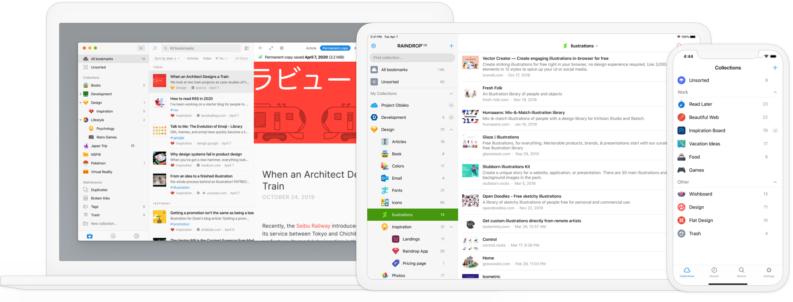

Use our Windows and Mac app from your desktop, or carry Raindrop.io around in your pocket with our iOS and Android app.
Everything stays in sync and accessible across every platform so you’ll never lose track of anything.

## Mobile App {#mobile}

### iOS / iPadOS
  
You can use our iOS app if your device is running iOS / iPadOS 16 or higher.

### Android
  
You can use our Android app if your device is running Android 7.0 or higher.

:::note
Be sure to check [**this article**](../../using/mobile-app/index.md) to know how to use mobile app.
:::

## Desktop App
### macOS
- [**Download for Intel chip**](https://raindrop.io/r/app/macos) *(use this if you not sure)*
- [**Download for Apple chip**](https://raindrop.io/r/app/macos-arm)

You can use our macOS app if your device is running macOS 12 or higher.

### Windows
[**Download**](https://raindrop.io/r/app/windows)

You can use our Windows app if your device is running Windows 10 (64bit) or higher.

### Linux
[**Download**](https://raindrop.io/r/app/linux)

### Universal (Progressive Web App)
Progressive Web App (PWA) is a way to install a website so it behaves like a desktop app — with its own icon, window, and quick access.

To install Raindrop.io as a PWA:

1. Open the web app: [https://app.raindrop.io/](https://app.raindrop.io/)
2. Follow the steps for your browser:

   * **Chrome**: Click ⁞ in the toolbar → `Cast, Save and Share` → `Install Raindrop.io…`
   * **Edge**: Click ··· in the toolbar → `Apps` → `Install Raindrop.io…`
   * **Brave**: Click ≡ in the toolbar → `Install Raindrop.io…`
   * **Safari** (macOS 14 Sonoma or newer): Click the `Share` button in the toolbar → `Add to Dock`
   * **Firefox**: PWAs are not supported.
   * **Other browsers**: PWA support is not available yet.