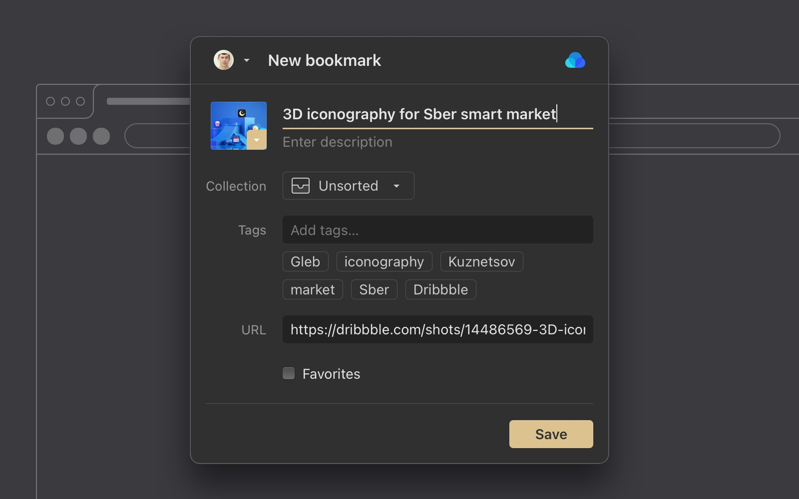
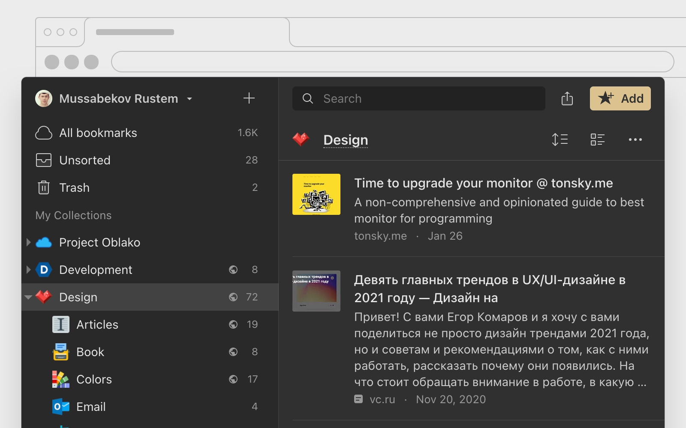

You can use Raindrop.io in your favorite browser and bookmark items using our browser extensions.

Collect and browse bookmarks without leaving the current tab. Our browser extension have the same features as web app, but in small form factor.
No more jumping throught tabs, your bookmarks always at hand.

:::note
Be sure to check [**this article**](../../using/browser-extension/index.md) to know how to use our extension.
:::

## Chrome, Brave
All three, Chrome, Brave all run on the same Chromium technology which means you can use the same extension in all browsers.

## Safari
To use our Safari extension, you need to download and install a small Mac app which will activate your extension.

## Edge
[**Install for Edge**](https://raindrop.io/r/extension/edge)

## Firefox

## Opera

## Bookmarklet (Universal)
Don’t see your browser in the list above? Install the Raindrop.io Bookmarklet by dragging the link below to your bookmarks/favorites toolbar:

    <a href='javascript:(function()%7Bvar rspW%3D450%2CrspH%3D600%2CrspL%3DparseInt((screen.width%2F2)-(rspW%2F2))%2CrspT%3DparseInt((screen.height%2F2)-(rspH%2F2))%3Bwindow.open("https%3A%2F%2Fapp.raindrop.io%2Fadd%3Flink%3D"%2BencodeURIComponent(window.location.href)%2B"%26title%3D"%2BencodeURIComponent(document.title)%2C"raindrop-save"%2C"width%3D"%2BrspW%2B"%2Cheight%3D"%2BrspH%2B"%2Cresizable%3Dyes%2Cscrollbars%3Dyes%2Cstatus%3Dfalse%2Clocation%3Dfalse%2Ctoolbar%3Dfalse%2Cleft%3D"%2BrspL%2B"%2Ctop%3D"%2BrspT)%7D)()'>
        <b>Save to Raindrop.io</b>
    </a>

