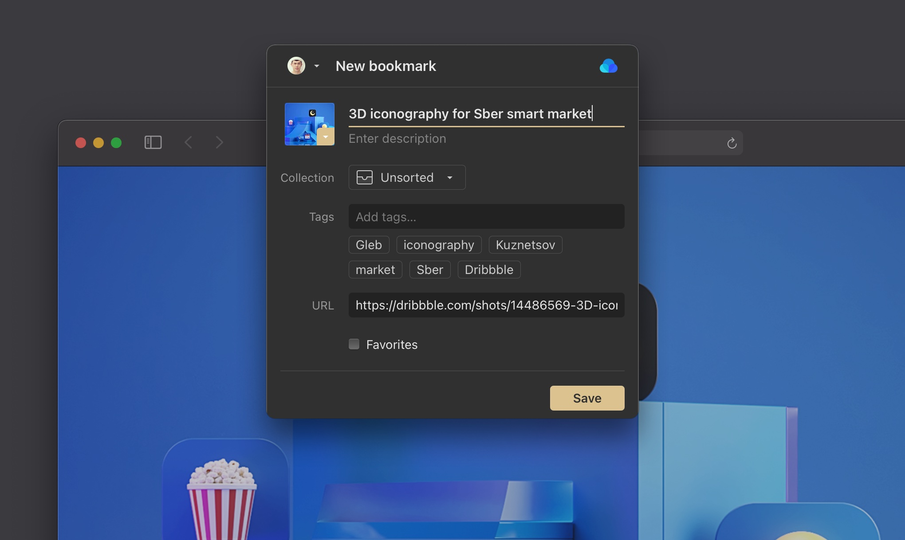

When you install the Raindrop.io extension in your browser, you can easily save any page or link by simply clicking the Raindrop.io button.

:::info
Be sure to check [**this article**](../../using/browser-extension/index.md) to know how to use our extension.
:::

## Chrome, Brave & Vivaldi
All three, Chrome, Brave & Vivaldi all run on the same Chromium technology which means you can use the same extension in all browsers.

## Safari 14
To use our Safari 14 extension, you need to download and install a small Mac app which will activate your extension.

## Edge
[**Install for Edge**](https://raindrop.io/r/extension/safari)

## Firefox

## Opera

## Bookmarklet (Universal)
Drag this button to the bookmarks bar:

    <a href='javascript:(function()%7Bvar rspW%3D450%2CrspH%3D600%2CrspL%3DparseInt((screen.width%2F2)-(rspW%2F2))%2CrspT%3DparseInt((screen.height%2F2)-(rspH%2F2))%3Bwindow.open("https%3A%2F%2Fapp.raindrop.io%2Fadd%3Flink%3D"%2BencodeURIComponent(window.location.href)%2B"%26title%3D"%2BencodeURIComponent(document.title)%2C"raindrop-save"%2C"width%3D"%2BrspW%2B"%2Cheight%3D"%2BrspH%2B"%2Cresizable%3Dyes%2Cscrollbars%3Dyes%2Cstatus%3Dfalse%2Clocation%3Dfalse%2Ctoolbar%3Dfalse%2Cleft%3D"%2BrspL%2B"%2Ctop%3D"%2BrspT)%7D)()'>
        <b>Save to Raindrop.io</b>
    </a>

