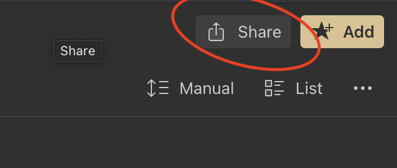

## Introduction
Raindrop.io can be easily integrated to other apps you use.

## Alfred
Search and add bookmarks to Raindrop.io right from [Alfred macOS app](https://www.alfredapp.com/)

[**Install Workflow**](https://github.com/westerlind/alfred-raindrop-search)

## Raycast
Search your Raindrop.io bookmarks in [Raycast](https://www.raycast.com/) app

[**Install extension**](https://www.raycast.com/lardissone/raindrop-io)

## Readwise
Sync and revisit your highlights in [Readwise](https://readwise.io/)

[**Connect Raindrop**](https://readwise.io/sync#raindrop)

## Unread
Just enable `Raindrop.io` in `Settings / Article Actions`

## Feedbin
Just enable `Raindrop.io` in [Share settings](https://feedbin.com/settings/sharing)

## Innoreader
Add custom site and provide special URL:   
`https://app.raindrop.io/add?link=[URL]&title=[TITLE]`   
Also make sure to **uncheck Shorten URLs before sharing**

## Feedly
Add a [custom sharing tool](https://feedly.com/i/account/saving-sharing) to your Feedly and provide special URL:   
`https://app.raindrop.io/add?link=${url}&title=${title}`

## One Click Save to Raindrop.io
Many RSS Readers support configuring custom share option in their user-interface.
You can configure one click save to Raindrop.io using this special URL:

`https://app.raindrop.io/add?link=${url}&title=${title}`

Please replace `${url}` and `${title}` part to appropriate as described in particular RSS reader documentation.

## Read Your RSS Feed
Your Raindrop.io collections are accessible using built-in RSS feeds.
With RSS, you can subscribe using your favorite reader and get notifications whenever new items are posted.

You can grab collection RSS feed link from the share window:

:::note
If the `Share` button is not visible, it means you are not viewing a collection. To enable sharing, create a collection and navigate to it—once you’re inside a specific collection, the Share button will appear.
:::