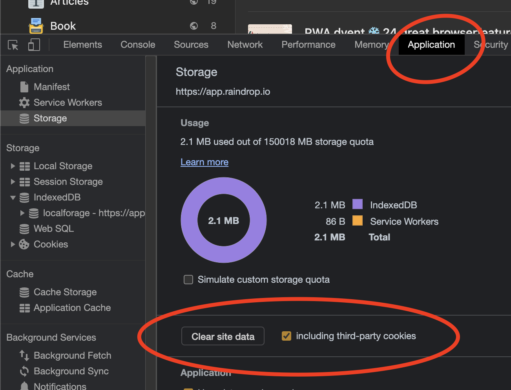
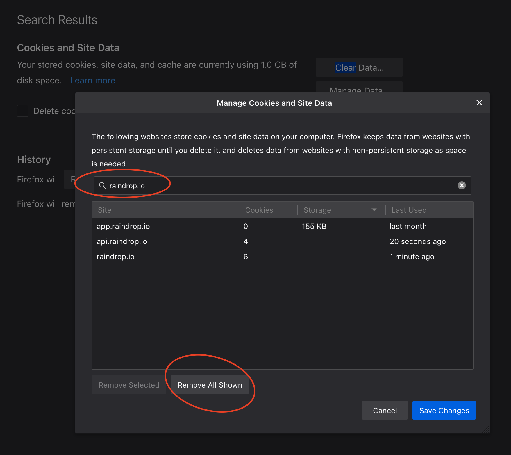
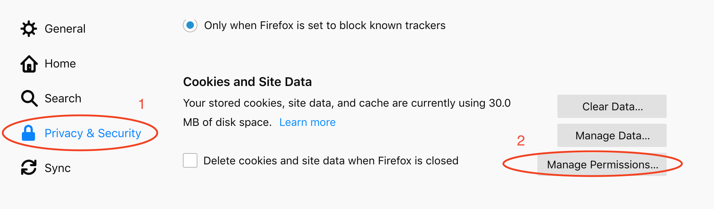

If you’re having login problems with Raindrop.io, here are a few ways to solve common issues.

### 🔥 Clear the browser cache {#clear-cache}
If you’re having a problem with Raindrop.io, you can try clearing your browser cookies. 
Here's how you can clear your Raindrop.io cookies on various browsers:

#### Chrome, Opera, Edge, Brave {#chrome-cache}

1. Visit https://app.raindrop.io/
2. Open developer console (press `Control+Shift+I` on windows, or `Command+Option+I` on mac)
3. Open **Application** tab, then click **Clear site data** (be sure to check "Including third-party cookies")
4. Refresh the page and login again

#### Safari {#safari}

1. Open the Safari Browser.
2. From the Menu go to **Preferences**.
3. Go to **Privacy** then click on **Manage Website Data**.
4. Type `raindrop.io` in the search box.
5. Select the website and click on **Remove**.

#### Firefox

1. Open Firefox Preferences
2. Go to `Privacy & Security`
3. Scroll down page and click `Manage Data...` in `Cookies and Site Data` section
4. Type **raindrop.io** in `Search websites field`
5. Click `Remove All Shown`

---

### Reset your password
First of try to [reset your password](../forgot-password.md). If this doesn't help try other solutions below.

---

### Disable VPN / Proxy / Adblock
VPN, Proxy or Adblock can be a problem, try to disable them temporarily

---

### Add Raindrop.io to your browser's whitelist
To ensure that Raindrop.io cookies work properly on your browser, add Raindrop.io to your browser's whitelist.

#### Chrome, Opera, Edge, Brave {#chrome-whitelist}

Paste this URL `chrome://settings/content/cookies` to address bar and press enter.
In the bottom of the page click `Add` (in `Allow` section) and paste this string **`[*.]raindrop.io`**

#### Arc {#arc-whitelist}

Paste this URL `arc://settings/cookies` to address bar and press enter.
In the bottom of the page click `Add` (in `Allow` section) and paste this string **`[*.]raindrop.io`**

#### Firefox

Open settings. Go to `Privacy & Security` section. 
Scroll to `Cookies and Site Data` and click `Manage Permissions...`

In `Address of website` put `https://api.raindrop.io` and click `Allow`.
Then click `Save Changes`

Also try to disable any privacy/blocking extensions you have.

---

### Logout me everytime I close a browser {#logoutme}
You probably enabled an option to clear data on browser close

#### Chrome, Opera, Brave {#logoutme-chrome}

1. Paste this url into address bar `chrome://settings/cookies`
2. Turn off `Clear cookies and site data when you quit Chrome`

#### Edge {#logoutme-edge}

1. Paste this url into address bar `edge://settings/clearBrowsingDataOnClose`
2. Click `Add` button in `Do not clear` list of `Cookies and other site data`
3. Paste **`[*.]raindrop.io`** and click `Add`

