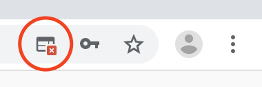
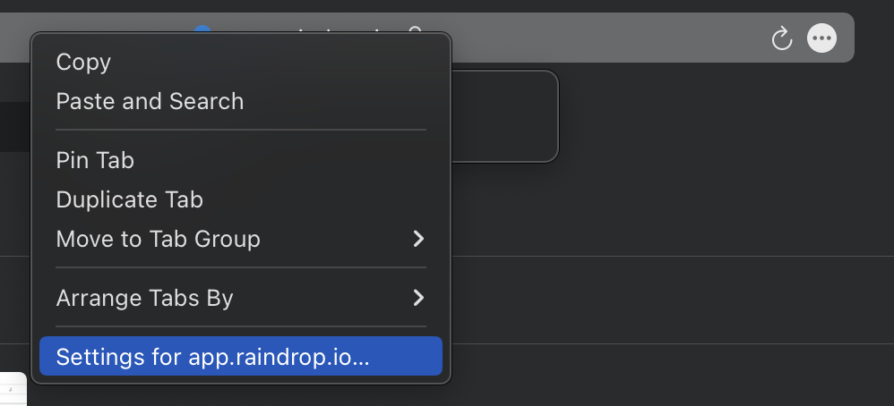
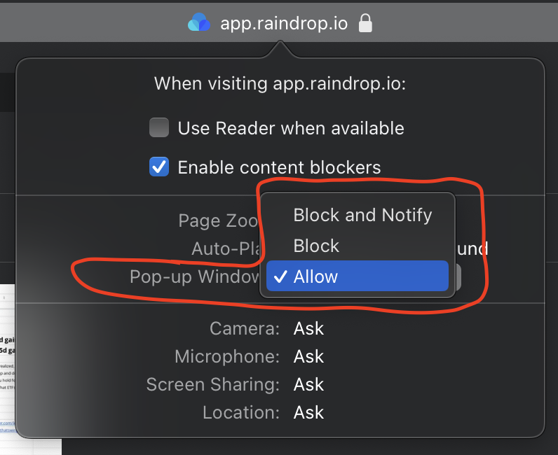
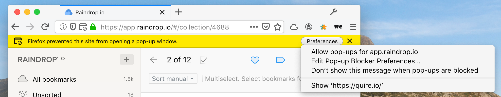
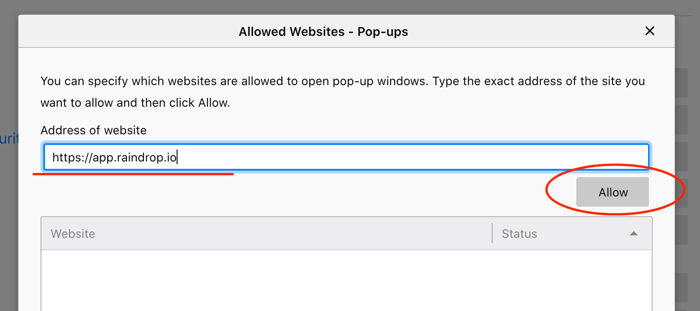

If nothing happens (or only one link is open) after you click on "Open in browser", probably your browser is blocking opening multiple tabs at once. 

Check guide how to fix this for your browser below:

## Chrome

Right after you try to open multiple tabs at once, you will see icon in address bar. Click on it and enable this functionality for raindrop.io domain

#### Other solution:
Paste this URL ``chrome://settings/content/popups`` to address bar and press enter. In "Allow" section click "Add" and paste this string ``[*.]raindrop.io``

## Safari

1. Right click on a URL bar and click `Settings for app.raindrop.io`

2. Set `Allow` for `Pop-up Windows`

## Firefox

Right after you try to open multiple tabs at once, you will see panel like in screenshot below. Click "Preferences" and "Allow pop-ups for app.raindrop.io" in context menu:

#### Other solution:
Paste this URL ``about:preferences#privacy`` to address bar and press enter.

Scroll to "Permissions" section and click "Exceptions..." button near "Block pop-up windows" checkbox:

Enter ``https://app.raindrop.io`` to "Address of website" field, click "Allow" and "Save Changes"

## Known limitations

By default only the first 40 bookmarks in a collection will be opened. If you need to open more, scroll down the collection to load additional bookmarks before clicking "Open all".

