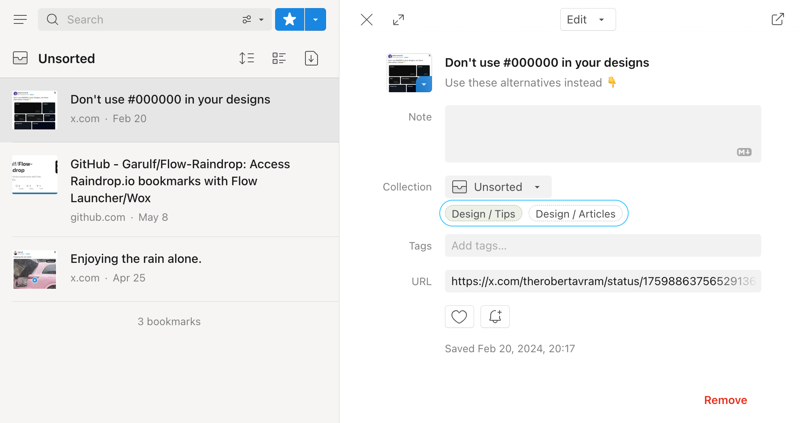
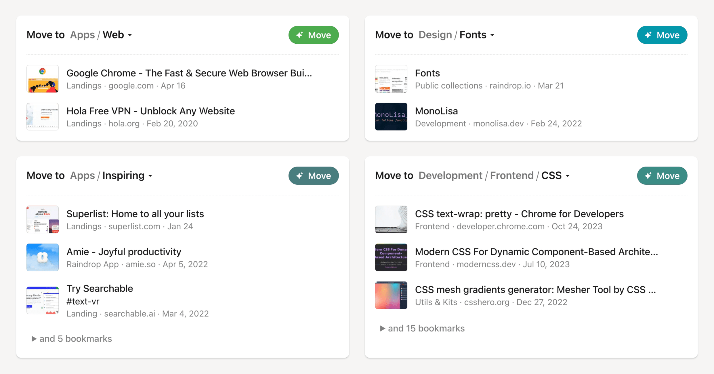

## Introduction

Say goodbye to the hassle of searching for the right collection or tag when you save a new bookmark — our new ✦ AI model automatically suggests the perfect ones for you!

You can easily correct organizational mistakes, simplify your tags, and tidy up unsorted bookmarks with just a few clicks on a [dedicated page](#tips).

We make sure to suggest **only your** collections and tags, keeping everything tailored to your personal style. Whenever you create a new collection or tag, AI takes note and includes it in future suggestions.
Although some **manual sorting is necessary** to fine-tune the AI and fix any errors.

:::info
You get **your own private AI categorization model** based on your data.   
Your data never used for training.
:::

:::note
Only available for [Pro subscription](https://raindrop.io/pro/buy) users
:::

## Getting started {#start}
Begin by having some organized bookmarks, which can be [imported from other services or browsers](../../getting-started/import.md). This initial organization helps train the AI effectively. If starting fresh, create a few collections and tags and start organizing.

Raindrop.io improves its categorization over time by learning from your interactions, so continuously refine your collections and introduce new tags to enhance your personal AI model.

## Quick suggestions {#quick}

### Browser extension

When you find an interesting link, click the Raindrop.io extension button. A bookmark form will appear, pre-filled with relevant collection and tag suggestions. Choose your preferred options and save the bookmark.

### Mobile app

For mobile users, share any intriguing link to Raindrop.io. A bookmark form with appropriate suggestions will pop up for quick saving.

### Web ⁄ Desktop app
To add bookmarks via the web or desktop app, click Add at the top right corner, paste the URL, and immediately see the suggested collections. Select the preferred collection to save your bookmark.

Editing an existing bookmark also provides refined suggestions for collections and tags, making organization simpler.

## Organization tips {#tips}

No need to sort your bookmarks right away. Whenever you find some free time, just pop over to the [organization tips page](https://app.raindrop.io/suggestions). There, you'll discover ready-to-use tips for enhancing your bookmark organization:

- Move unsorted bookmarks to the ideal collection
- Correct misplaced bookmarks
- Tag bookmarks
- Simplify tags
- More in the future

These tips are customizable, allowing you to alter the suggested collections, tags, and exclude bookmarks from these actions.

:::info
Check [your organization tips here](https://app.raindrop.io/suggestions)
:::

Regularly visit this page, especially after modifying your collections or tags, to keep your bookmarks perfectly organized with just a few clicks.

## FAQ
### Why don't I see any suggestions?
The AI model might not have enough data to make predictions yet.
Please start by creating a few collections and tags, and apply them to your bookmarks.
We ensure that suggestions are based only on the collections and tags you've already set up—we don't generate new ones like some other services might, as those tend to be too generic and not as useful.

### What if the suggestions are incorrect?
If the suggestions don't seem quite right, just select the correct ones when organizing your bookmarks. This feedback helps the AI model learn and improve over time. If you need further assistance, feel free to reach out to our support team.

### How to turn off suggestions?
1. Go to [app settings](https://app.raindrop.io/settings/app)
2. Turn off `Suggested collections and tags`