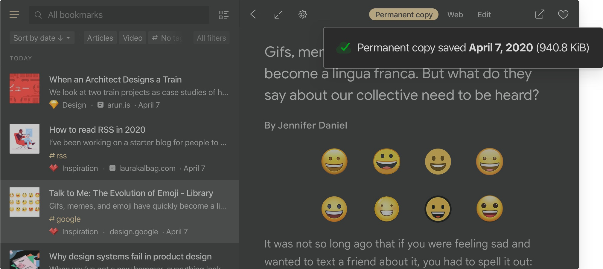

The bookmarks and files you save to your Raindrop.io are stored on Raindrop.io's servers. In other words, they’re stored “in the cloud”.

This means that your collection will be available on any computer or mobile device (phone or tablet) that is connected to your Raindrop.io account.

## Permanent Copies

Raindrop.io automatically creates copies of all web-pages and files in your collection. That way, even if an item changes or is taken offline, you will be able to open the version that you have saved in Raindrop.io.

:::note
Only available in [Pro plan](../../billing/premium-features.md)
:::

Web-pages are saved entirely with CSS, fonts and images. Raindrop is only one bookmark manager that can save JS-heavy (SPA) web-pages. Permanent copy is fully portable, static and doesn't have any external data source dependencies or scripts. All ads and tracking scripts are stripped away!

Content of web-pages and PDF's is fully searchable as described in [full-text search documentation](../search/index.md).

Space for your copies is unlimited. Link to your copy is private and can't be made public.
When PRO subscription is expired, permanent copies become unaccessible and could be removed in future.

### How long it takes to copy all of my bookmarks?
It's depends on count of your bookmarks and global queue. Usually 1000 bookmarks will be copied in half an hour. If it takes a lot longer, <a onClick={()=>Beacon('open')} target="_self">let us know</a>.
:::note
Be sure that after upgrade to PRO, copies will not appear immediately. We need some time to copy each of your bookmarks, as described above.
:::

### How to access permanent copy?
:::note Web app, desktop app or browser extension
Right click on a bookmark and select "Open permanent copy"
:::

:::note Mobile app
Right click on a bookmark and select "Open permanent copy"
:::

### Limitations
Some bookmarks or files can't be saved by several reasons described below. 
When this happen you will see a special icon 

#### Known limitations:
- Bookmarks in "Trash" are ignored and not saved
- Maximum size of entire web-page/file is limited by 70 Mb
- Video, audio and iframes included in web-page could not be saved
- Web-pages with fancy animations based on scroll position could not be saved correctly
- Links that require login or not publicly accessible could not be saved
- Small amount can't be saved due to script failure, those will be automatically retried
- If you found bookmark that marked as "failed to copy" by mistake, <a onClick={()=>Beacon('open')} target="_self">please send</a> this link

## Export to File

Because your collections is stored in the cloud, you do not need to create special backups of your saved Raindrop.io items.
However, If you wish to download your bookmarks for other uses you can use our export tool which creates a downloadable HTML file.

To access our export tool, visit [settings page](https://app.raindrop.io/settings/backups) and click **Export .html file**.   
You will receive an email shortly. 

HTML file will contain:
- Collections
- Links
- Tags

  

## Automatic Backups

If you want to be even more confident, just use our automatic backup solution that supports Dropbox and Google Drive at the moment.
Backups are made automatically shortly after you make any change in Raindrop.io.
:::note
Only available in [Pro plan](../../billing/premium-features.md)
:::

Here how to enable automatic backup:
1. Visit [settings page](https://app.raindrop.io/settings/backups)
2. Turn on/off particular account in `Cloud backup` section
3. Shortly after first backup will be made

### Backup to Dropbox
You can find your backup in `/Apps/Raindrop.io` folder

### Backup to Google Drive
Backup will be saved to `Raindrop.io-Export.html` file

