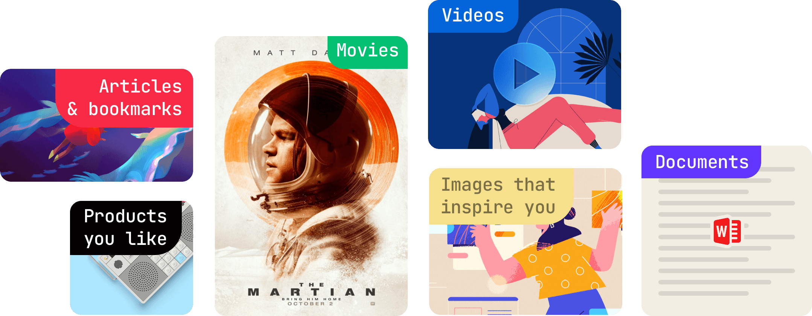

## Introduction
See the big picture by bringing all your materials together
From images to maps, videos to websites, Raindrop.io lets you save everything in a centralized and searchable place.

Raindrop.io generates handy thumbnails and extracts all relevant info about each link.

## Manage

<!------------------------------>

### Add New Bookmark

Raindrop.io makes it easy to save interesting content you find on the web.
This page outlines the methods you can use to save any link to your List.

#### Saving with the Browser Extension
The [Raindrop.io extension](../../getting-started/install-extension/index.md) is a small button that sits in your browser toolbar.
It's available for many browsers. When clicked, it will save the current page to Raindrop.io.

#### Manually Saving to a link to Raindrop.io
1. Visit [Raindrop.io App](https://app.raindrop.io)
2. Click the + button in the top toolbar
3. Insert the URL you’d like to save. Don’t forget the http://
4. Click Save

<!------------------------------>

### Change order

By default, bookmarks are shown in the order in which they were added (new on top).
You can change the order by changing sort option or by manually dragging and dropping your bookmarks.

<!------------------------------>

### Change collection

#### Drag n drop
You can transfer an item to a different collection by dragging it from its current collection onto the menu item of the collection you’d like to transfer it to.

#### Move multiple items
Start by highlighting the items that you want to copy by hovering over the items and clicking the tick mark that appears in the top left corner.
Once you have selected the items you wish to move, select ‘Move’ from the toolbar at the top of the screen. 
A window will ask which collection you want to move the items into, select or type the collection’s name into the text box.
Your items will now be moved into the second collection!

<!------------------------------>

### Change thumbnail

When you add something, Raindrop.io will try to pull in an image from the site.
Sometimes that image doesn’t work for you; it might be a shot generated from a video that is too grainy or an image of your old boss you never want to see again.
Either way, it’s easy to change an image you hate.

To change a thumbnail of an item click on `Edit` button and then click on a thumbnail. 

If there are other images on the bookmarked webpage that Raindrop.io can pull from the site, they will be showed in grid.
Alternatively, you can upload an image that you like from your desktop by clicking on 'upload'.

<!------------------------------>

### Add description

You can add descriptions to your items already uploaded to Raindrop.io by clicking onto the `Edit` button.
You can also add descriptions when adding items directly to Raindrop.io using the [browser extension](../../getting-started/install-extension/index.md) or [mobile app](../../getting-started/download-app/index.md).

<!------------------------------>

### Manage tags

#### Adding a tag
If you want to add tags to a single item, click `Edit` button.
Now you will see the option to tag underneath 'Tags', here type in as many tags as you like separated by commas.

Tip: you can tag your items when you add them to Raibdrio,ui when you use one of our [browser extension](../../getting-started/install-extension/index.md) or using [mobile app](../../getting-started/download-app/index.md).

#### Add tags to multiple items
You can add tags to multiple items in your collection too.
First highlight the items you want to tag by hovering over the items until the tick appears in the left corner, and then click on the tick.
Highlight as many items as you like, then click `Add tags` in the menu bar at the top. When the pop-up appears, type in your tags separated by commas. 

#### Remove tags from multiple items
First highlight the items you want to tag by hovering over the items until the tick appears in the left corner, and then click on the tick.
Highlight as many items as you like, then click `More...` / `Remove tags` in the menu bar at the top. 

<!------------------------------>

### Remove

#### Remove multiple items
First highlight the items you want to remove by hovering over the items until the tick appears in the left corner, and then click on the tick.
Highlight as many items as you like, then click `Remove` in the menu bar at the top. 

<!------------------------------>

### Open Multiple Links at Once

First highlight the items you want to open by hovering over the items until the tick appears in the left corner, and then click on the tick.
Highlight as many items as you like, then click `Open` in the menu bar at the top.

[Check this article](../../troubleshooting/open-multiple-links/index.md) if you have any troubles with this feature.

## View

<!------------------------------>

### Preview

If you just want to quickly check a link, you don't need to open it in new tab.
Raindrop.io features a special viewer (and reader for articles) that allows you to have seamless experience.
Very useful in the case of videos or music.

#### Articles
Raindrop.io extracts the article text and removes web advertisements and other distractions to provide a wonderful reading experience.

#### Refresh preview

<!------------------------------>

### Customize appearance

Every Raindrop.io collection is unique. Whether you add videos, images, bookmarks, files, or a combination of all of these, your collection should be easy to navigate, feel organized, and look beautiful.

On any plan you can choose view modes to fit your needs better and make your content shine: list, grid, headlines and masonry.

#### Change view mode

---

#### List
You might recognize `list`, our default view mode.
Useful information is surfaced (including who, what, and when the item was created), making it a great fit for alphabetical and date sorting.
Ideal for bookmarks, files, and list building.

---

#### Grid
Ideal for the grid-obsessed, items get cropped to clean and tidy squares. 
See your content on a level playing field (regardless of type), and drag to reorder your collection with ease. 
For the visually inclined, toggle labels off and let the thumbnails stand out.

---

#### Headlines
When thumbnails aren’t a priority, Headlines mode gives you a quick and simple way to scan your items at a glance.

---

#### Masonry
Masonry assembles your items like a jigsaw puzzle. This view is an excellent way to view mood boards or content streams where a strict order is not relevant.

---

#### Hide labels
Also, you can choose to hide labels (because sometimes images speak louder than words).

<!------------------------------>

### Customize default actions

Adjust what buttons appear when you mouse over on each bookmark, change click behavior, and more. Tailor Raindrop.io to fit your style.

1. Visit [settings page](https://app.raindrop.io/settings/app)
2. Change `Click on a bookmark` behaviour
3. Or change `Buttons` that appear on mouse over on a bookmark (you can add a maximum of 5 buttons)

