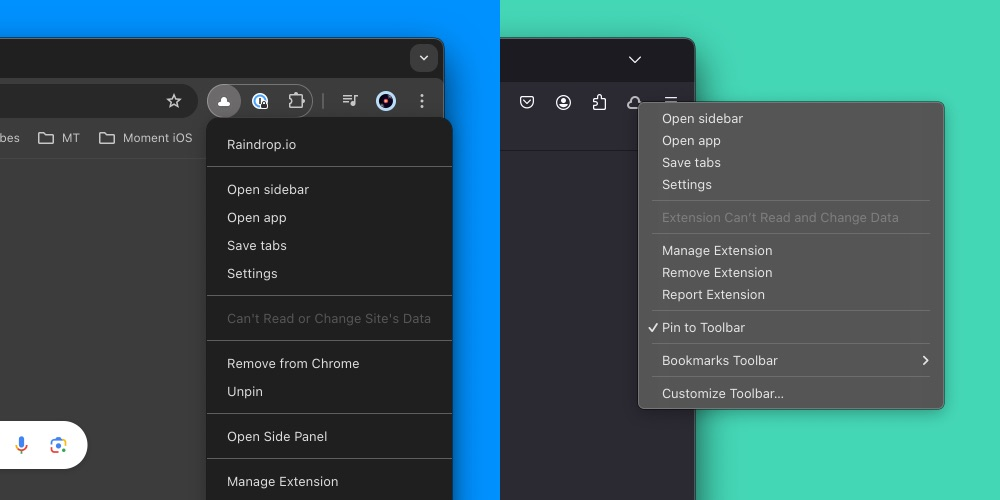

:::info Important
Please [install browser extension](../../getting-started/install-extension/index.md)
:::

## Getting started
With our browser extension, you can easily add new bookmarks and conveniently access them.   
There are multiple ways to access the Raindrop.io extension in your browser:

### Toolbar button
When you're browsing the web and want to save your current web page to Raindrop.io, use the Raindrop.io toolbar button to do it in just a few clicks.

If you cannot locate the Raindrop.io cloud toolbar button, please click on the "puzzle" icon first and then pin it for easy access.

### Side panel
In Chrome, Edge and Firefox, you have the option to open the Raindrop.io side panel, providing you with constant and convenient access to your bookmarks.
What's even cooler is that you can simply drag new links and images into the panel to save them.

#### Chrome, Edge
Press `Ctrl + .` on Windows or Linux, or `⌘ + .` on macOS. Alternatively, right-click the Raindrop.io icon in the toolbar and select `Open Sidebar`.

#### Firefox
Press `Ctrl + .` on Windows or Linux, or `⌘ + .` on macOS. Alternatively, go to the main menu and select `View > Sidebar > Raindrop.io`.   
Or <a href="https://support.mozilla.org/kb/use-firefox-sidebar-access-bookmarks-history-synced" target="_blank">pin sidebar button in a toolbar</a> to have a quick access

### Context menu
Right click anywhere on the page and select one of available Raindrop.io actions like:
- [Save link, image, audio or video](#save-page)
- [Save highlight](../highlights/index.md)

## How to

### Save Page {#save-page}
1. Browse to a website or video you would like to save to Raindrop.io 
2. Click the Raindrop.io extension button or press a [keyboard shortcut](#hotkeys)
3. Click the `Save` button to send the content to the `Unsorted` or chosen collection

### Save Link or Image
1. Right-click on a link or image
2. Select `Save link` or `Save image`

### Add highlight
[Learn more](../highlights/index.md#add-extension)

### Save All Tabs {#save-tabs}
When you have many tabs open, saving them one at a time is a bit tedious. Instead you can save them at once.

**How to use?**
1. Right-click on the Raindrop.io extension
    - If you don’t see the Raindrop.io extension icon, click the `puzzle` icon
2. Click `Save tabs`

By default saved tabs will have a tag with a date. That way you can find them easily later.

### Search from Address Bar
You can search your bookmarks right from browser address bar by typing special keyword before your query.

Just type ``rd`` and then your search query. For example `rd design`.

:::tip
Feel free to use [advanced search operators](../search/index.md#operators) to find precisely
:::

:::warning
This feature is not available in Safari, Vivaldi
:::

:::note
**Chrome only**: Make sure that Chrome `Settings / Search engine / Keyboard shortcut` setting value is `Space or tab`
:::

### Enable Saved Page Indicator {#saved-indicator}
See if a page already saved: special [✔] indicator will be showed when you visit already saved page

    
    

1. Click on a Raindrop.io extension button
2. Click on your profile avatar
3. Click `Settings`
4. Enable `Saved page indicator` in `Permissions` section

## Tips & tricks

### One Click Save
Do you prefer to save new bookmarks as fast as possible and organize them later?
Follow few simple steps to enable one click save mode:

1. Click on a Raindrop.io extension button
2. Click on your profile avatar
3. Click `Settings`
4. Select `Clipper` in `Appearance` section
5. Enable `Save automatically` in `New bookmark` section

## Shortcuts {#hotkeys}

### Chrome, Brave
Command | macOS | Windows, Linux
------- | ------ | --------------
Bookmark / highlight | ⌘⇪S | Ctrl+Shift+S
Open sidepanel | ⌘. | Ctrl+.

#### Change shortcuts
Paste `chrome://extensions/shortcuts` URL into browser address bar and press Enter

### Edge
Command | macOS | Windows, Linux
------- | ------ | --------------
Bookmark / highlight | ⌃X | Alt+X
Open sidepanel | ⌘. | Ctrl+.

#### Change shortcuts
Paste `chrome://extensions/shortcuts` URL into browser address bar and press Enter

### Firefox
Command | macOS | Windows, Linux
------- | ------ | --------------
Bookmark / highlight | ⌃X | Alt+X
Open sidepanel | ⌘. | Ctrl+.

[How to change extension shortcuts](https://support.mozilla.org/en-US/kb/manage-extension-shortcuts-firefox)

### Safari
Command | macOS
------- | ------
Bookmark / highlight | ⌘⇪S

Not possible to customize shortcuts yet

## Privacy & FAQ
### What data does the extension collect?
The browser extension does not do or collect anything unless you tell it to. It sits quietly in the background, waiting for you to interact with it.

What that means is, only if you press a button (for example: Raindrop.io) will it send a URL, or an image to the Raindrop.io servers so we can bookmark it for you. We will NEVER access anything else in your browser without your permission and explicit action.
