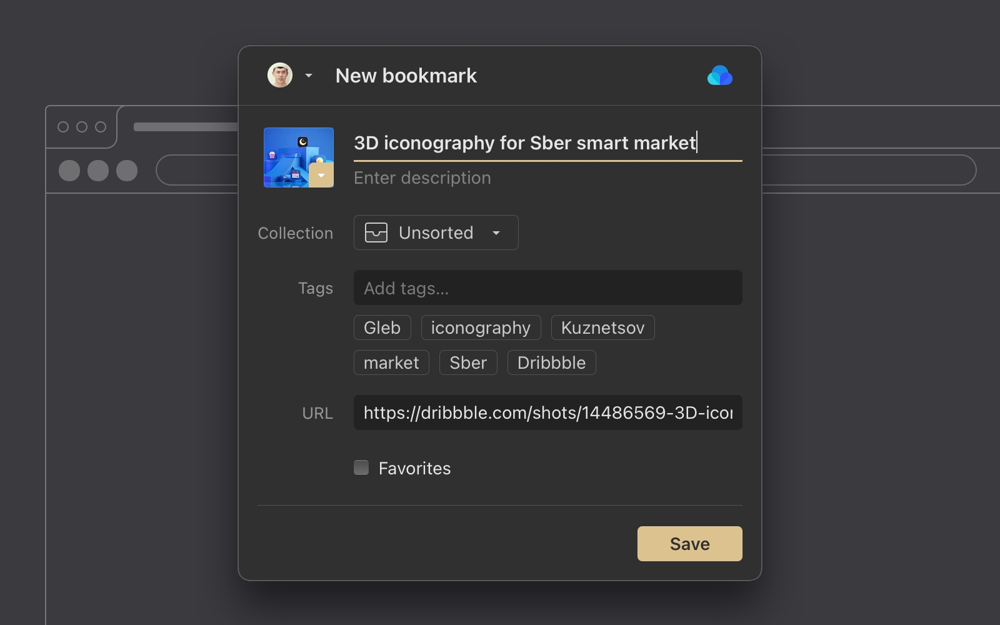
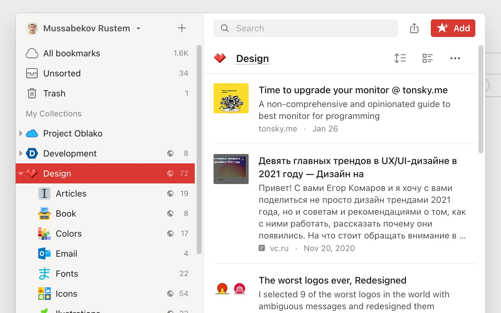

Using our browser extension is the quickest way to add links, images, and stuff to your Raindrop.io collections straight from your favorite web browser.

## Appearance
When you first time install our extension you will be promted to select prefered look and feel of an extension:

<!------------------------------>

### Clipper

Clipper is the most simple and fastest way to save new bookmarks.

<!------------------------------>

### Mini App

Mini App gives you the same experience as our web site but in compact size. You can browse, search, organize and add new bookmarks.

## Save Page
1. Browse to a website or video you would like to save to Raindrop.io 
2. Click the Raindrop.io extension icon to launch the Clipper or Mini App (depends on your settings)
3. Click the `Save` button to send the content to the `Unsorted` or chosen collection

## Save Link or Image
1. Right-click on a link or image
2. Select `Save link` or `Save image`

## Save All Tabs
This feature not ready yet. Hope to release it later this year.

## Highlight Saved Pages
See if a page already saved. Special [✔] indicator will be showed when you visit already saved page

## Use Hotkeys
To access a list of all available hotkeys (keyboard shortcuts):
1. Click on a extension button
2. Click on your profile name
3. Click Settings
4. Scroll down Settings page and notice "Hotkeys" section
5. Click "Change hotkeys" to rebind them (optional, only available in Chrome & Firefox)

## Search in Address Bar
You can search your bookmarks right from browser address bar by typing special keyword before your query.

Just type ``rd`` and then your search query. For example rd design

:::note
This feature only available in Chrome, Opera and Firefox browser
:::note

## Privacy & FAQ
### What data does the extension collect?
The browser extension does not do or collect anything unless you tell it to. It sits quietly in the background, waiting for you to interact with it.

What that means is, only if you press a button (for example: Raindrop.io) will it send a URL, or an image to the Raindrop.io servers so we can bookmark it for you. We will NEVER access anything else in your browser withour your permission and explicit action.