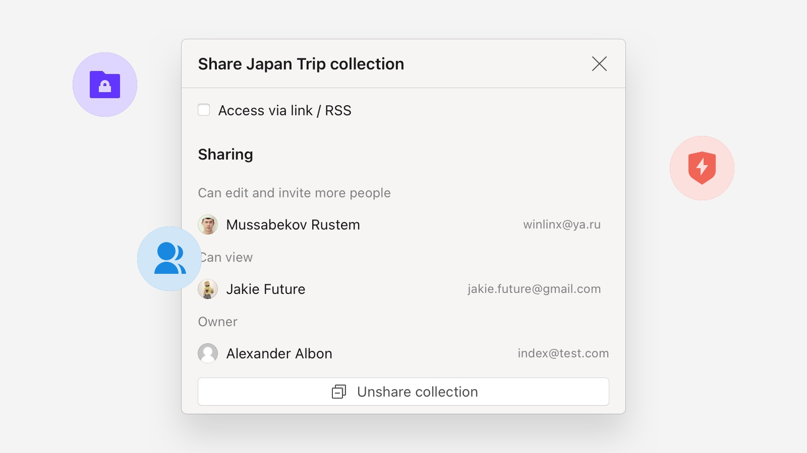
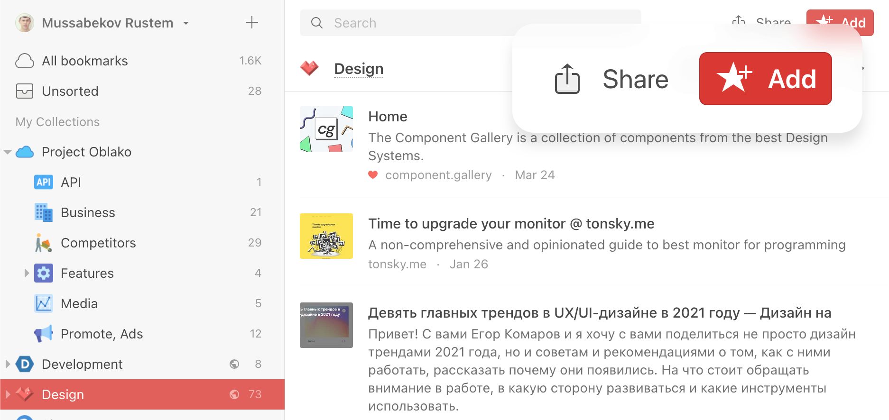

When someone is added to your collection as a collaborator, they’ll be able to do everything you can do in the collection, such as adding, editing and deleting items.

If the owner of the collection is on the [Pro plan](../../billing/premium-features.md), every collaborator will also have access full-text search and permanent copies on that collection, even if they’re not on a Pro plan.

Don’t want the person to be able to add / edit / delete items, but do want them to view your collection? [Read about permissions](#permissions) below.

## Invite a person to your collection
To invite someone to collaborate on your collection, open the collection, then click the `Share` in top right corner of the screen. 

Then click `Collaboration` to manage existing collaborators or invite new ones.

Click on `Invite` to generate a unique join link, which you can then share with a new collaborator.

## Permissions
By default, every Raindrop.io collection you create is private and only visible to you.
You have the option to change this privacy setting to whatever suits your collection best.
You can change the privacy settings from the collection screen by clicking the `Share` button in the top right corner of your collection. 

