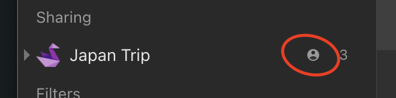
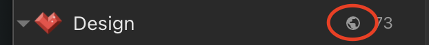

## Introduction
Collections are essentially just folders.
Whether you’re planning a presentation, preparing for an event or creating a website, create a collection so all the important items are saved in one central place.

Each collection have a unique icon selected from thousands [searchable icons library](#change-icon).
You can choose [view modes](../bookmarks/index.md#customize-appearance) to fit your needs better and make your content shine: list, grid, headlines or masonry.

Also, you can choose to [hide labels](../bookmarks/index.md#customize-appearance) (because sometimes images speak louder than words), 
[drag to reorder](#change-order) your items, or [sort your items](#change-order) by date, title, and kind.

Collections and items are **private by default**. It means only you can access them, until you decide to make them [public](#public-collections).

<!------------------------------>

### Unsorted collection

The `Unsorted` is your default collection in Raindrop.io. When you add an item, it goes straight to your Unsorted unless you specify that the item goes into a specific collection.

This collection is useful to temporarly put new items in it and sort them later.

<!------------------------------>

### Nested collections

Nested collections give your an extra level of flexibility and power.

Keep your ever-growing collections list neat and organized with nested collections.
For example, you might create "parent" collection called "Music" and put "Pop", "Rock" and "Electronic" underneath.

:::note
Nested collections are only available in [Pro plan](../../billing/premium-features.md)
:::

You can collapse sub-collections under their “parent” to temporarily hide them from view.
This helps to focus on the right collections at the right time, without getting distracted by everything else.

Nested collections are also a great way to share multiple collections at once. 
When you share a "parent" all of it sub-collections become accessible by collaborators automatically.

<!------------------------------>

### Shared collections

You can enable access to your collection(s) by team members or friends. Permissions let you control who can access each of your collections.
You will notice a special "user" icon next to the name of a collection:

Learn more about sharing and collaboration [here](../collaboration/index.md).

<!------------------------------>

### Public collections

You can share individual collections with the entire web. Sign-up is not required.
You will notice a special "globe" icon next to the name of a collection:

Learn more about public collections [here](../public-page/index.md).

<!------------------------------>

### Groups

Groups help you split your collections list into smaller chunks. 
For example, you might create "Work" and "Home" groups and then organize various collections underneath each one.

Learn more about groups [here](#create-rename-or-remove-group).

<!------------------------------>
## Manage

### Create a collection

When you log in to Raindrop.io and you’ll see the dashboard.   
There’s a button `+` located in left side of a screen, click on it and a field will appear right above currently active collection.

Type a name then press `Enter`.  
Or if you not happy with a location of new collection just drag and drop it to any other level/location.

If you want to create a nested collection for currently active just `Shift+click` on `+` or drag and drop a field to desired level/location. 

<!------------------------------>

### Change order

Just drag a collection to reorder

Drop it in desired location or move over another collection to make it parent

You can even sort all collections at once by name (ascending):
1. Mouse over any group then click "..." button
2. In context menu that appear click "Sort all collections by name"

<!------------------------------>

### Change icon

1. Right click on a collection
2. Click "Change icon"

3. Icon selector window will appear. Here you can select a predefined icon or search any specific. Click "Remove" in top right corner to unset icon for a collection.

:::caution
We use external sites ([Icons8](https://icons8.com/icons) and [Iconsfinder](https://www.iconfinder.com/)) to fetch icons.  
So please don't send requests to add any new icons to our email.
:::

<!------------------------------>

### Rename

1. Right click on a collection

2. Then click "Rename"

<!------------------------------>

### Relete

Collection itself and all nested collections will be removed.
Bookmarks will be moved to "Trash"

1. Right click on a collection

2. Then click "Remove"

<!------------------------------>

### Merge

You can merge all items from one collection into another from your dashboard.
Sharing and collaboration settings will also be merged.

1. Right click on a collection

2. Then click "Select"

3. Keep selecting other collections you want to merge

4. Click "Merge" and wait for action to complete

<!------------------------------>

### Create, Rename or Remove Group

Mouse over `My collections` label and click `...` next to it:

<!------------------------------>

### Collapse all

You can collapse all nested collections at once in few easy steps.
This feature especially useful when you have very deep expanded structure and do not want to collapse each level manually.

1. Mouse over any group then click "..." button
2. In context menu that appear click "Collapse all collections"

