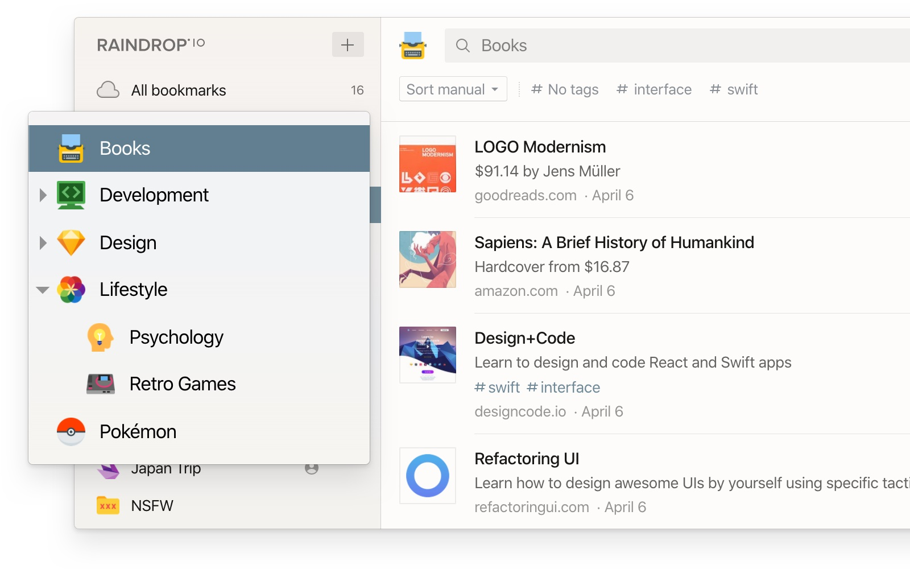
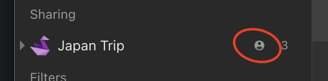

## Introduction
Collections are essentially just folders.
Whether you’re planning a presentation, preparing for an event or creating a website, create a collection so all the important items are saved in one central place.

Each collection have a unique icon selected from thousands [searchable icons library](#change-icon).
You can choose [view modes](../bookmarks/index.md#appearance) to fit your needs better and make your content shine: list, grid, headlines or masonry.

Also, you can choose to [hide labels](../bookmarks/index.md#appearance) (because sometimes images speak louder than words), 
[drag to reorder](../bookmarks/index.md#sort) your items, or [sort your items](../bookmarks/index.md#sort) by date, title, and kind.

Collections and items are **private by default**.
It means only you can access them.

Make it [public](#public-collections) or [shared](#shared-collections) to enable access for other people.

### Shared collections
You can enable access to your collection(s) by team members or friends. Permissions let you control who can access each of your collections.
You will notice a special "user" icon next to the name of a collection:

Learn more about sharing and collaboration [here](../collaboration/index.md).

### Public collections
You can share individual collections with the entire web. Sign-up is not required.
You will notice a special "globe" icon next to the name of a collection:

Learn more about public collections [here](../public-page/index.md).

### Unsorted collection
The `Unsorted` is your default collection in Raindrop.io. When you add an item, it goes straight to your Unsorted unless you specify that the item goes into a specific collection.

This collection is useful to temporarily put new items in it and sort them later.

### Nested collections
Nested collections give your an extra level of flexibility and power.

Keep your ever-growing collections list neat and organized with nested collections.
For example, you might create "parent" collection called `Music` and put `Pop`, `Rock` and `Electronic` underneath.

You can collapse sub-collections under their "parent" to temporarily hide them from view.
This helps to focus on the right collections at the right time, without getting distracted by everything else.

Nested collections are also a great way to share multiple collections at once. 
When you share a "parent" all of it sub-collections become accessible by collaborators automatically.

### Trash collection
When you delete an bookmark or file, they are moved to the `Trash` special collection.
You can restore an item from the `Trash` to your library by moving it to any other collection.
You can delete an item permanently by clicking the trash icon (or by right-clicking and choosing `Delete`).

### Groups
Groups help you split your collections list into smaller chunks. 
For example, you might create "Work" and "Home" groups and then organize various collections underneath each one.

Learn more about groups [here](#create-rename-or-delete-group).

## Manage

### Create a collection
When you log in to Raindrop.io and you’ll see the dashboard.   
There’s a button `+` located in left side of a screen, click on it and a new collection field will appear right above currently active collection.

You can also right-click on `My collections` or the name of a group and choose `Create collection`

Type a name then press `Enter`.  
Or if you not happy with a location of new collection just drag and drop it to any other level/location.

Nested collections can be created by dragging and dropping an existing collection onto another collection or by right-clicking a collection and choosing `Create nested collection`.
You can convert a nested collection into a top-level collection by dragging it out of the collection and dropping it into empty space in the left Raindrop.io pane.

### Change order
1. Just drag a collection to reorder

2. Drop it in desired location or move over another collection to make it parent

---

You can even sort all collections at once by name (ascending):
1. Mouse over "My collections" label in sidebar and click "..." button
2. In context menu that appear click "Sort all collections by name"

### Change icon
1. Right click on a collection

2. Click "Change icon"
3. Icon selector window will appear. Here you can select a predefined icon or search any specific. Click "Delete" in top right corner to unset icon for a collection.

:::warning
We use external sites ([Icons8](https://icons8.com/icons) and [Iconsfinder](https://www.iconfinder.com/)) to fetch icons.  
So please don't send requests to add any new icons to our email.
:::

### Rename
Right-click on the collection and choose `Rename` to give a collection a new name

### Delete

#### Delete single collection
Right-click on the collection and choose `Delete` to delete a collection from your library.
Deleting a collection does not delete the items in the collection. Items will be moved to `Trash`.

Deleting a collection will also delete its subcollections (but not the items in them).

---

#### Delete multiple collections
1. Right click on a collection
2. Then click "Select"
3. Keep selecting other collections you want to merge
4. Click "Merge" and wait for action to complete

---

#### Delete all empty collections {#remove-all-empty}
1. Mouse over `My collections` label and click `...` next to it:

2. Click "Delete all empty collections"

### Merge
You can merge all items from one collection into another from your dashboard.
Sharing and collaboration settings will also be merged.

1. Right click on a collection

2. Then click "Select"

3. Keep selecting other collections you want to merge

4. Click "Merge" and wait for action to complete

### Create, Rename or Delete Group
Mouse over `My collections` label and click `...` next to it:

### Collapse all
You can collapse all nested collections at once in few easy steps.
This feature especially useful when you have very deep expanded structure and do not want to collapse each level manually.

1. Mouse over any group then click "..." button
2. In context menu that appear click "Collapse all collections"

### Export
Learn more [here](../export/index.md)