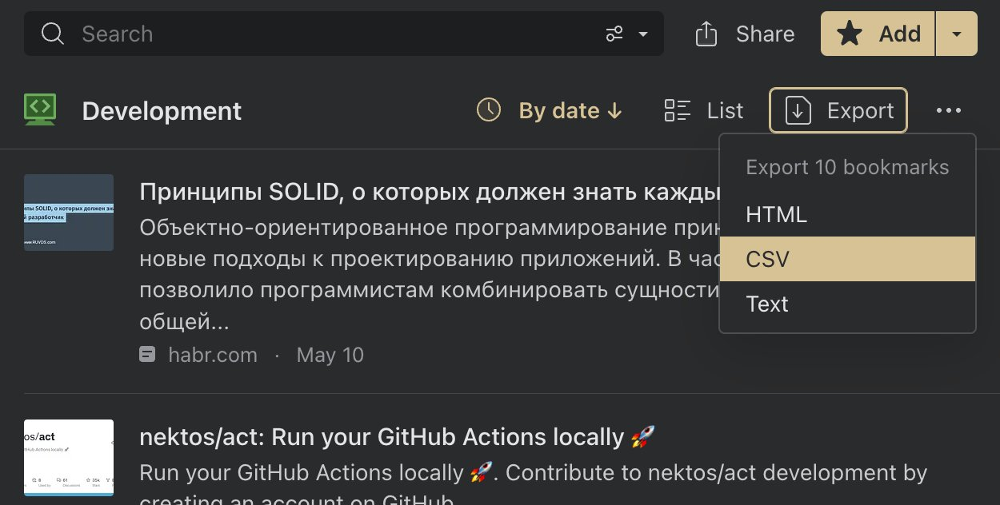

If you wish to download your bookmarks for other uses you can use our export tool which creates a downloadable `HTML`, `CSV` or `TXT` file

:::note
Consider to [create a backup](../backups/index.md) if you need to download all account data
:::

## Export collection
1. Go to specific collection
2. Click `Export` button
3. Select format you wish to download

## Export search
1. Start your search
2. Click `Export` button
3. Select format you wish to download

## Export some bookmarks
Start by highlighting the items that you want to export by hovering over the items and clicking the tick mark that appears in the top left corner.
Then click `Export` button and select format you wish to download

## Export all account data
[Create a backup](../backups/index.md) to download all account data