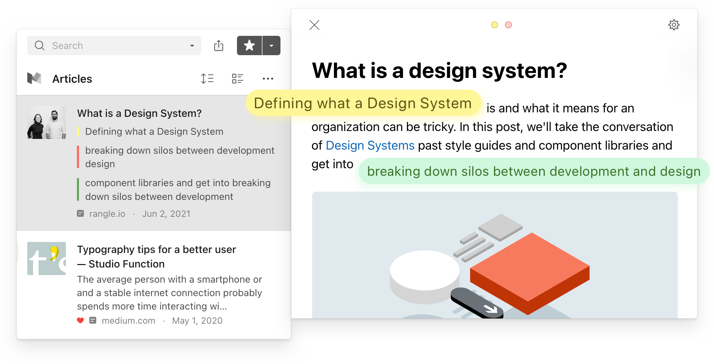

Highlighting while reading has enormous benefits.
It helps you engage more deeply with the text, comprehend dense subjects, and easily revisit key passages in the future.

You can create highlights in Raindrop.io [Browser extension](../../getting-started/install-extension/index.md), [Desktop](https://raindrop.io/download), [Web](https://app.raindrop.io) and [Mobile](https://raindrop.io/download) app.

:::note
Highlighting is available for all users. There's no limit on total number of pages and highlights.
But annotations (notes) is [premium feature](../../billing/premium-features.md).
:::

## Create highlight {#add}
Creating a highlight is as simple as selecting text.
When you highlight a passage, the text background will turn yellow so it stands out from the rest of the page.

### Browser extension {#add-extension}
1. Click & drag your mouse across the text that you would like to highlight
2. Select `Save highlight` from context menu or:   
    a. *Google Chrome*: Press `Ctrl+Shift+S` (or `Cmd+Shift+S` on a Mac)    
    b. *Other browser*: Press `Alt+X` (or `⌃X` on a Mac)
3. *Only once*: Accept permission request. [Why?](#extension-permission)

:::warning Very important!
In Safari (macOS) be sure to click **Always Allow on Every Website** when it ask for permission

:::

### Safari iOS extension {#add-extension-safari-ios}
Select the text you would like to highlight, then tap the color button

----

#### Only once:
1. Open iOS **Settings**
2. Go to `Safari / Extensions / Raindrop.io`
3. Tap `All Websites` or `Other Websites` and select **Allow**
4. Restart Safari

### iOS & Android app {#add-mobile}
1. Tap on a bookmark
2. Select the text you would like to highlight, then tap the color button

:::note
On iOS you can add highlights in Safari browser. [**Learn more**](#add-extension-safari-ios)   
:::

:::note
Unfortunately Chrome on Android doesn't support such functionality yet
:::

### Web & Desktop app {#add-web}
1. Click on a bookmark, then go to `Web` or `Preview` tab
2. Click & drag your mouse across the text that you would like to highlight
3. Select desired highlight color and/or add annotation

## Change Color, Annotate, Copy or Delete Highlight {#edit}
When you click (or tap) on a highlight, it takes you to the additional actions. From here, you can take further action on your highlighted passages, including:
- **Change color**
- **Annotate (add note)**: leave your instant thoughts on your highlight, Markdown is supported
- **Copy** to clipboard
- **Delete**: Remove the highlight from the page

## View and Manage Highlights {#manage}
You can see all of your highlights of particular page in one place

### Browser extension {#manage-extension}
1. Click Raindrop.io extension icon in a browser toolbar
2. Click `Highlights` button

### iOS & Android app {#manage-mobile}
1. Go to edit bookmark screen
2. Tap `Highlights`

### Web & Desktop app {#manage-web}
1. Click on a bookmark
2. Click `Highlights` button in the bottom of the page

Click on any highlight in the list to jump to it on the page. This navigation works only in the `Preview` tab within the desktop or web app, not in the browser extension.

## Export Highlights {#export}
You can export highlights of particular page as `text` or `CSV` file

### Browser extension {#export-extension}
1. Click Raindrop.io extension icon in a browser toolbar
2. Click `Highlights` button
3. Click `Export` icon

### iOS & Android app {#export-mobile}
Not implemented yet

### Web & Desktop app {#export-web}
1. Click on a bookmark
2. Click `Highlights` button in the bottom of the page
3. Click `Export` icon

## Search Highlights {#search}
You can apply the `Highlights` filter to see all of your highlights across all of your bookmarks in one place.

## Sync {#sync}

### Readwise {#sync-readwise}
[Connect your Raindrop account](https://readwise.io/welcome/sync#raindrop)

## FAQ
### Can I highlight PDF?
Yes, you can! There's one limitation worth knowing: if you open a PDF directly in your browser's built-in viewer, you won't be able to highlight it.
To highlight, first save the PDF as a bookmark or upload as file to Raindrop.

### Why you need additional browser extension permission? {#extension-permission}
To be able to see highlights next time you visit same page we need additional permission called `Access data on websites`.
Don't worry we not track you or send data to third-parties. We just check URL of a page and then load your saved highlights.

Many extensions have this permission by default. But not ours. We decided to ask you explicitly.