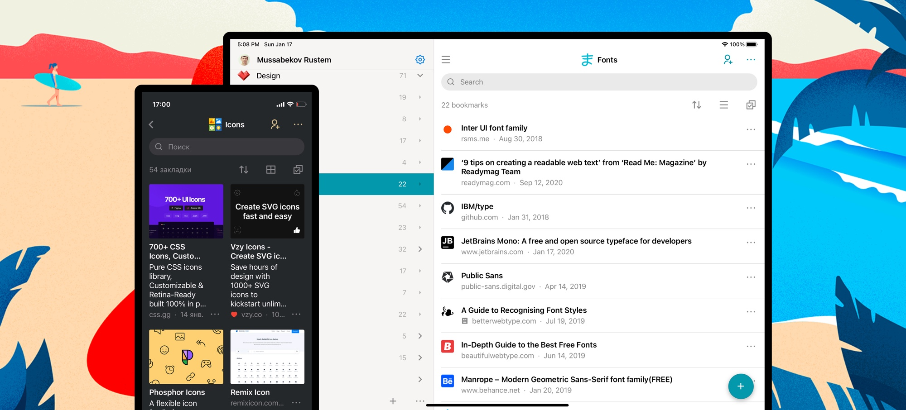

You can save pages and files directly from your mobile browser and from most apps that use the default share menu.
When you tap Share, you’ll be presented with a list of share options, and you will find Raindrop.io.

To use the Raindrop.io Share Extension, you’ll need to [install our mobile app](../../getting-started/download-app/index.md#mobile) and enable extension:

## Android {#share-android}
Look for the Share button. It can usually be found in your device’s menu, or when tapping the share menu in an app (usually found in a menu or toolbar).
When you tap Share, you’ll be presented with a list of share options, and you will find <b>Raindrop.io</b> which is usually at the top of the list.

## iOS

### iOS Share Extension {#share-ios}
Enabling the Raindrop.io Share Extension is easy, and only takes a moment. Here's how:

1. Tap the Share button in Safari or any other app
2. Swipe the top row (with the colored icons) and tap More
3. Enable Raindrop.io
4. (Optional) Move Raindrop.io to the top of the list
5. Tap Done

### iOS "Add to Unsorted" Action {#action-ios}
Enabling the `Add to Unsorted` Action is easy, and only takes a moment. Here's how:

1. Tap the Share button in Safari or any other app
2. Swipe list down and tap `Edit Actions...`
3. Enable `Add to Unsorted` and tap `+`
4. (Optional) Move `Add to Unsorted` to the top of the list
5. Tap Done

### iOS Safari Extension {#share-ios-safari}
To install an extension, you need to [download our app from the ‌App Store‌](https://raindrop.io/r/app/ios) first. 

1. Launch Safari on your iPhone or iPad.
2. Tap the Reader/Extensions button in the toolbar. It looks like "AA" with a puzzle piece next to it.
3. In the menu that pops up, tap Manage Extensions.
4. Turn the toggle to ON (green) for Raindrop.io.
5. Next time you need Raindrop.io extension just tap puzzle icon again

### iOS Shortcuts {#shortcuts-ios}
Raindrop.io supports [Apple Shortcuts](https://support.apple.com/guide/shortcuts/welcome/ios), allowing you to automate common actions using the Shortcuts app or Siri.

To get started, open the **Shortcuts** app on your iPhone or iPad, tap **+** to create a new shortcut, and search for **Raindrop.io** in the actions list.

## Import from mobile Safari
You can't import bookmarks from Safari using our mobile app.

Instead open Safari on your Mac, then click `File / Export bookmarks...` menu item and follow instructions [here](../../getting-started/import.md).

## Import from mobile Chrome
You can't import bookmarks from Chrome using our mobile app.

Instead open Chrome on your Mac or Windows, then [export bookmarks](https://www.wikihow.com/Export-Bookmarks-from-Chrome) and follow instructions [here](../../getting-started/import.md).