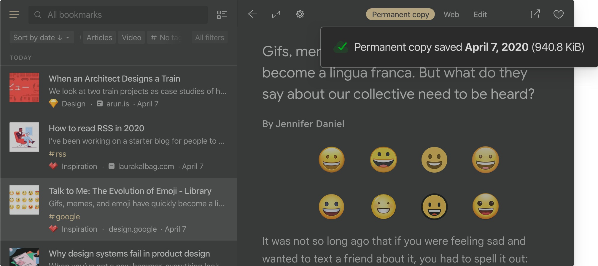

Raindrop.io automatically creates copies of all web-pages and files in your collection. That way, even if an item changes or is taken offline, you will be able to open the version that you have saved in Raindrop.io.

:::info
Only available in [Pro plan](../../billing/premium-features.md)
:::

Web-pages are saved entirely with styles, fonts and images.
Permanent copy is fully portable (single file), static and doesn't have any external data source dependencies or scripts. All ads and tracking scripts are stripped away!

Content of web-pages, PDF's and EPUB's is fully searchable as described in [full-text search documentation](../search/index.md).

Space for your copies is unlimited. Link to your copy is private and can't be made public.
When PRO subscription is expired, permanent copies become inaccessible and could be removed in future.

## How long it takes to copy all of my bookmarks? {#time}
It's depends on count of your bookmarks and global queue. Usually 1000 bookmarks will be copied in half an hour. If it takes a lot longer, [let us know](/contact-us).
:::note
Be sure that after upgrade to PRO, copies will not appear immediately. We need some time to copy each of your bookmarks, as described above.
:::

## How to access permanent copy? {#open-permanent-copy}
:::note Web app, desktop app or browser extension
Right click on a bookmark and select "Open permanent copy"
:::

:::note Mobile app
Tap "..." next to bookmark, then tap "Open permanent copy"
:::

## How to download a permanent copy?
[Open permanent copy](#open-permanent-copy), then click `Download` and follow the instructions

## Limitations
Some bookmarks or files can't be saved by several reasons described below. 
When this happen you will see a special icon 

### Paywall content is not saved
Unfortunately, we currently do not have the capability to save paid content.
Many other services retrieve the entire content of a page from your browser and send it to their servers.
However, this approach raises concerns regarding privacy. Do you really know how that data is used after save?

To prioritize user privacy, Raindrop will not support saving paid content unless we find a more privacy-friendly solution.
As a temporary workaround, you can save a page as a PDF and then upload it to Raindrop.

### Other known limitations:
- Links that require login or not publicly accessible could not be saved
- Bookmarks in "Trash" are ignored and not saved
- Some websites block automated bots, we can't save such webpages yet
- Maximum size of entire web-page/file is limited by 70 MB
- Video, audio and iframes included in web-page could not be saved
- Web-pages with fancy animations based on scroll position could not be saved correctly
- Small amount can't be saved due to script failure, those will be automatically retried
- If you found bookmark that marked as "failed to copy" by mistake, [please send](/contact-us) this link
