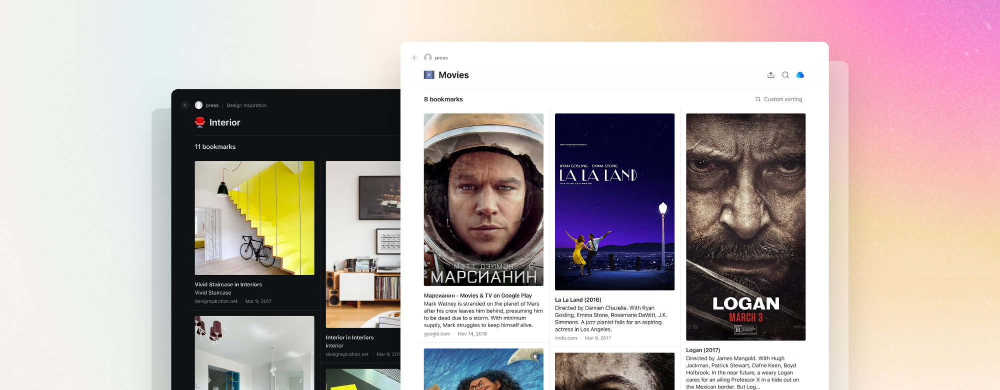

Share individual collections with the entire web. No login required for viewing.
Just note that this only makes your collection visible, and the ability to add/edit/delete items is still limited to [collaborators](../collaboration/index.md) you specifically added.

---

1. To enable public access open the collection, then click the `Share` in top right corner of the screen.

2. From here, please enable `Access via link/RSS`

