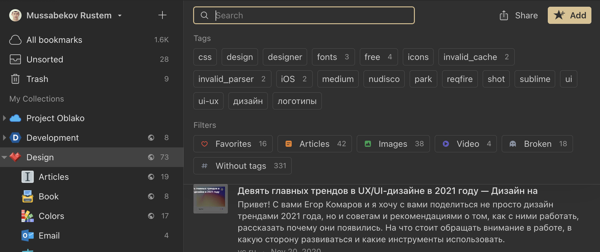

## Introduction

To use Search in Raindrop.io on your computer, click the search field shown above (the magnifying glass icon), then type in your search and click the Enter button.

When searching in Raindrop.io with a free account, you can find items in your collections by Title, Description, Tag, Type and URL.
[Raindrop.io Pro](../../billing/premium-features.md) plan offers a [full-text search](#full-text-search) feature

### Why Raindrop.io search is so awesome?
- Small spelling mistakes in search queries are auto-corrected.
- We apply some language-specific optimizations like: Stemming (words like «drives», «drove», «driven» for example are perceived as same word) and plural insensitive search for English, Russian, Mandarin, Spanish, Portuguese, Italian, French, German, Japanese, Polish, Korean, Finnish, Turkish, Dutch, Swedish and Danish languages.
- Search results are sorted by relevancy by default

## Full-Text Search
Raindrop can search through the entire content of every bookmark and PDF you’ve saved, making it extremely easy to find what you’re looking for. It's like your personal Google!

Your bookmarks are indexed automatically, no need to do anything. Usually only meaningful content of web-page is indexed. Ads, navigation, comments and so on are stripped if possible. Plus Raindrop is only one bookmark manager that could index JS-heavy web-pages!

:::note
Be sure that newly added bookmark will not appear in search results immediately. We need some time as described in [this article](../backups/index.md#how-long-it-takes-to-copy-all-of-my-bookmarks) to copy and index each bookmark.
:::

Found part of the web-page will be highlighted in search results along with other details:

### Known Limitations
- Indexing is happen with slight delay, usually few minutes
- Fuzzy search is not supported in full-text search
- Bookmark should have a permanent copy to support full-text search