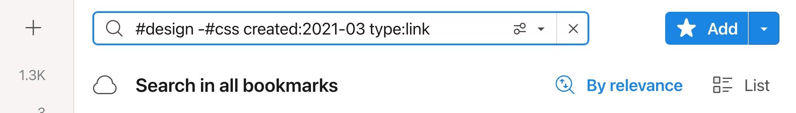
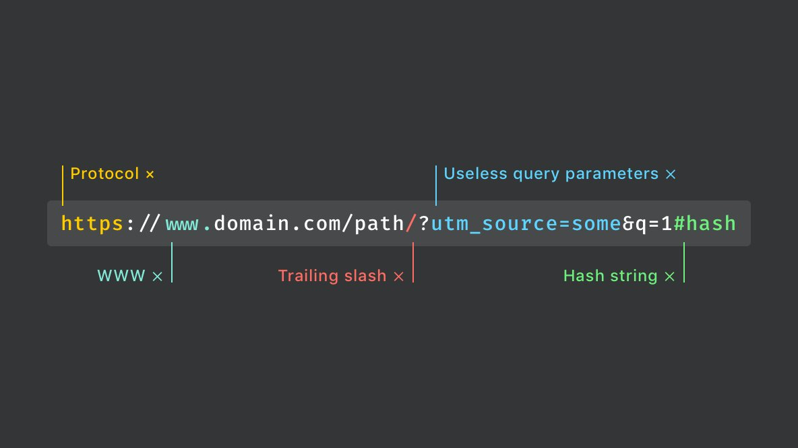

Raindrop offers robust search capabilities, allowing you to locate bookmarks by various details, including title, description, notes, URL, tags, type, date, or the [full content](#full-text-search) of a webpage, EPUB, or PDF (without OCR).

Enhance your search experience with the [Pro version](../../billing/premium-features.md), which supports natural language queries. This feature means you don't need to remember exact keywords—simply type your question as you would normally speak.
Additionally, the [Pro version](../../billing/premium-features.md) allows you to search for bookmarks in multiple languages.

Refine your search results further by using our [advanced search operators](#operators), designed to help you find exactly what you're looking for with precision.

## Recent Searches {#recent}
Raindrop will remember your ten most recent searches so you can easily return to the list of results.
Plus, these recent searches will sync across your apps so you can continue a search on another device or computer.

## Full-Text Search {#full-text-search}
Raindrop can search through the entire content of every bookmark, EPUB and PDF (no OCR) you’ve saved, making it extremely easy to find what you’re looking for. It's like your personal Google!

Your bookmarks are indexed automatically, no need to do anything. Usually only meaningful content of web-page is indexed. Ads, navigation, comments and so on are stripped if possible.

### How to use full-text search?
1. Be sure you have a [Pro plan](../../billing/premium-features.md)
2. Focus on a search field, type your request and press Enter

:::note
Be sure that newly added bookmark will not appear in search results immediately. We need some time as described in [this article](../permanent-copy/index.md#time) to copy and index each bookmark.
:::

### Turn off full-text search
If you want to temporarily disable full-text search please select `In title/description` filter from suggestions.

Or type `info:` before your search query.

## Advanced Search Operators {#operators}

To find precisely you can craft advanced searches using Boolean operators.

Listed below are the search operators we support, with quick examples showing how they may be used.   
No need to remember everything listed below, our smart search suggestions will show them for you.

Mix-and-match to find exactly what you're looking for.

| Operator | Example | Explanation |
| - | - | - |
| `apple iphone`          | apple iphone              | Find items that contains such words in title, description, domain or in web page content |
| `"sample"`              | "superman vs. batman"     | Find items that contains exact phrase in title, description, domain or in web page content |
| `-sample`               | -superman   -#coffee  | Requires that the search results do not include this word or condition |
| `#tag`                  | #coffee                   | Find items that have a certain tag |
| `#"one tag"`            | #"coffee beans"           | Find items that have a certain multi-word tag |
| `match:OR`              | superman batman match:OR  | Find items with either search term |
| `created:YYYY-MM-DD`   `created:YYYY-MM`   `created:YYYY` |  | Search for items created in specific date.   Put < or > in front of a date to find before or after specific date respectively |
| `lastUpdate:YYYY-MM-DD` | lastUpdate:2021-07-15     | Search for items updated in specific date |
| `title:sample`          | title:css   title:"css grid" | Find items with a certain word (or words) in the title |
| `excerpt:sample`        | excerpt:css   excerpt:"css grid" | Find items with a certain word (or words) in the description |
| `note:sample`           | note:css   note:"css grid" | Find items with a certain word (or words) in the note |
| `link:sample`           | link:drop   link:"crunch base" | Find items with a certain word (or words) in the URL |
| `type:sample`           | type:link   type:article   type:image   type:video   type:document   type:audio | Find by content type |
| `❤️`                     | ❤️                         | Find all favorites |
| `file:true`              | file:true                  | Find uploaded files |
| `notag:true`            | notag:true                | Find items without tags |
| `cache.status:sample`   | cache.status:ready   -cache.status:ready | Find items that have (or not) a [permanent copy](../permanent-copy/index.md) |
| `reminder:true`         | reminder:true             | Find items with reminder |

## Broken links
Raindrop.io can regularly scan your bookmarks to see if the links are still alive.
If a page goes offline, you’ll spot a little "ghost" icon next to its domain name, letting you know it’s no longer available.

### Find all broken links {#find-broken}
Select `Broken links` filter from search field suggestions.

:::info
Only available in [Pro plan](../../billing/premium-features.md)
:::

### Delete broken links
1. [Find broken links](#find-broken) you want to delete
2. Highlight the items you want to delete by hovering over the items until the tick appears in the left corner, and then click on the tick.
3. Highlight as many items as you like, then click Delete in the menu bar at the top.

### Troubleshooting
Check [this article](../../troubleshooting/false-broken-links/index.md) if you have any problems with broken links checker.

## Duplicates
Have you ever bookmarked a page more than once?

Duplicate bookmarks take up space and needlessly add to a surplus of saved pages.
Raindrop.io can help you locate and delete duplicates bookmarks.

### Find all duplicates {#find-duplicates}
Select `Duplicates` filter from search field suggestions.

:::info
Only available in [Pro plan](../../billing/premium-features.md)
:::

:::tip
When you click on `Duplicates` filter you will see **only** duplicate bookmarks.
This list not includes **originals**. So it's safe to delete them all.
:::

### Delete duplicates
1. [Find duplicates](#find-duplicates) you want to delete
2. Highlight the items you want to delete by hovering over the items until the tick appears in the left corner, and then click on the tick.
3. Highlight as many items as you like, then click Delete in the menu bar at the top.

### How duplicates finder works internally?
A bookmark is considered a duplicate only if its URL is exactly the same as a previously saved bookmark.   

All garbage from URL like different protocol, WWW, trailing slashes, useless query parameters (like referral id or advert source) and hash strings are ignored.

## Limitations
- Full-text search
    - Indexing happens with a slight delay, usually few minutes
    - We can index up to 300,000 characters in one document/page
    - Bookmark should have a [permanent copy](../permanent-copy/index.md) to support full-text search
