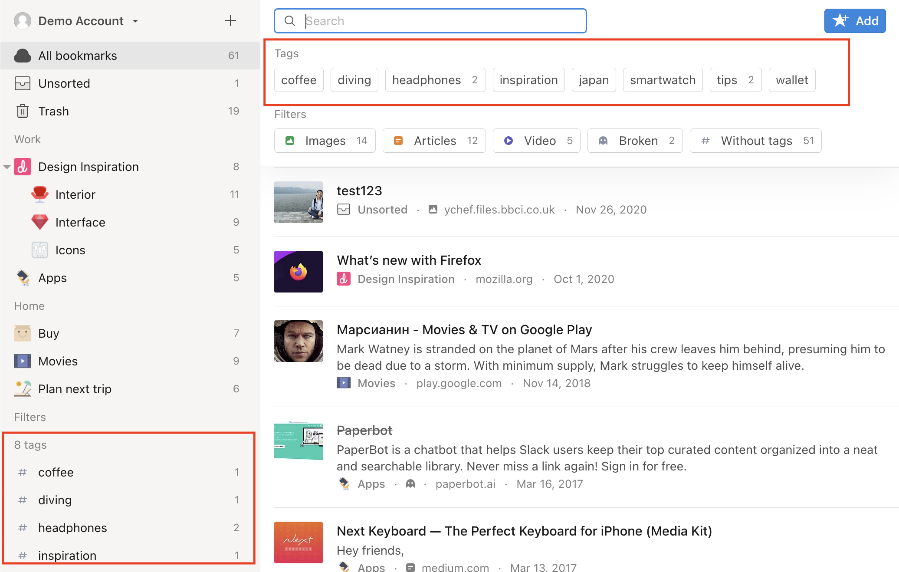
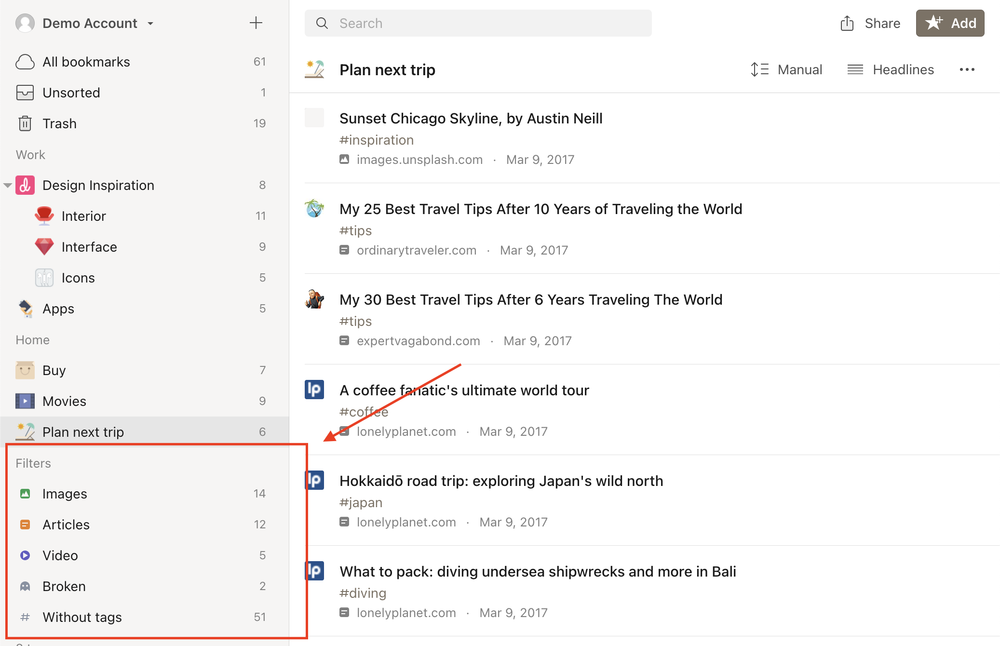
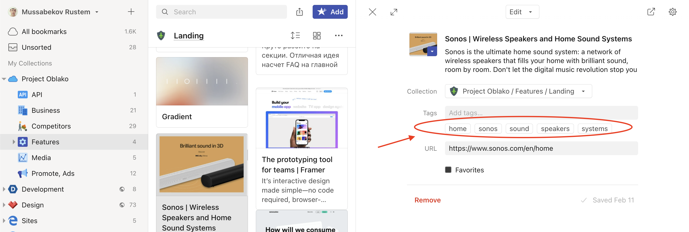
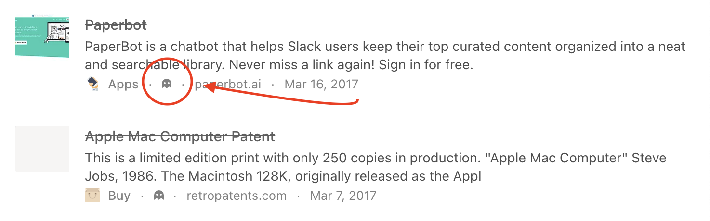

## Tags
Tags (often called 'keywords' in other contexts) allow for detailed characterization of an item.
You can tag items based on their topics, methods, status, ratings, or even based on your own workflow (e.g., 'to-read').
Items can have as many tags as you like, and you can filter your library (or a specific collection) to show items having a specific set of one or more tags.

Raindrop.io tags are special. They allow you to name them using any characters, in any language and most importantly – with spaces.
You_wont_need_to_name_your_tags_like_that_anymore.

<!------------------------------>

### Search by tag

All of your tags are visible in the sidebar on the left of your browser.
You can click one of these and Raindrop.io will bring up all items tagged with that tag, much like a global search.

The search box at the top of a screen can be used to search for tags.
Type in the search box to see all tags that match.

<!------------------------------>

### Adding tags to items

Read more in [bookmarks article](../bookmarks/index.md#tags)

<!------------------------------>

### Bulk editing tags

To rename/remove a tag across all items it is assigned to please use our [Tag manager](https://extension.raindrop.io/#/app/tags).

You can merge tags by selecting them and then click `Merge`.

<!------------------------------>

### Find items without tags

<!------------------------------>

### Suggested tags

Suggested Tags takes the work out of keeping your list organized.
After upgrading to [Pro plan](../../billing/premium-features.md), you’ll see a list of Suggested Tags whenever you tag an item, and can add them with just a click.

## Filters
In Raindrop.io, you can use filters to help you find what you need faster.
You can apply one or more filters by clicking the search field at the top of the bookmarks list.
The following filters are available:

<!------------------------------>

### Favorites

<!------------------------------>

### Articles

<!------------------------------>

### Images, Videos, Audios & Documents

## Premium Filters

<!------------------------------>

### Broken links

Raindrop.io periodically check all your bookmarks for availability. If any URL hit dead you will notice a special 'ghost' icon next to bookmark domain name.

Click `Broken` filter in sidebar to find all of them.

Check [this article](../../troubleshooting/false-broken-links.md) if you want to configure it or have a problems with it.

<!------------------------------>

### Duplicates

Have you ever bookmarked a page more than once? Duplicate bookmarks take up space and needlessly add to a surplus of saved pages.
Raindrop.io can help you locate and remove duplicates bookmarks.

You can find them in sidebar in Filters section:

When you click on Duplicates filter you will see only duplicate bookmarks. This list will not contain originals. So it's safe to remove them all.

> Original is bookmark that created initially, the first one  
> Duplicates are all that created after

