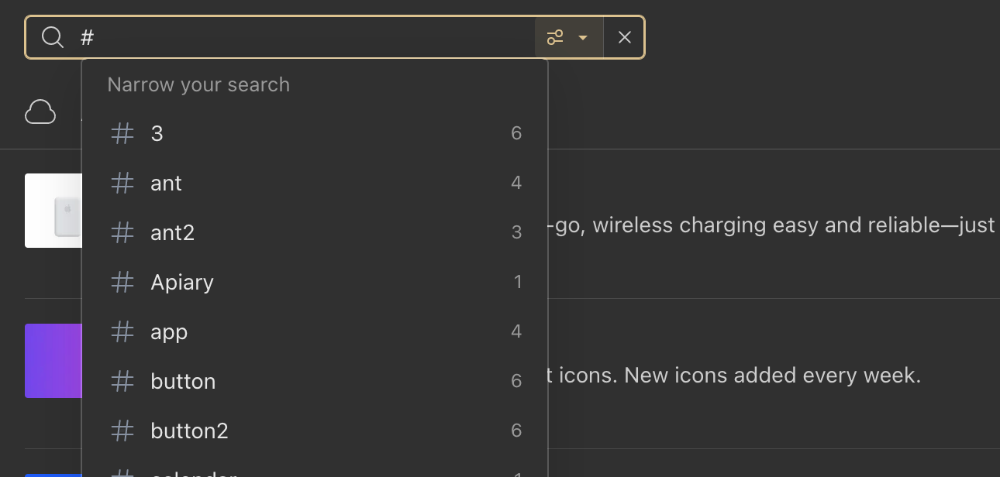
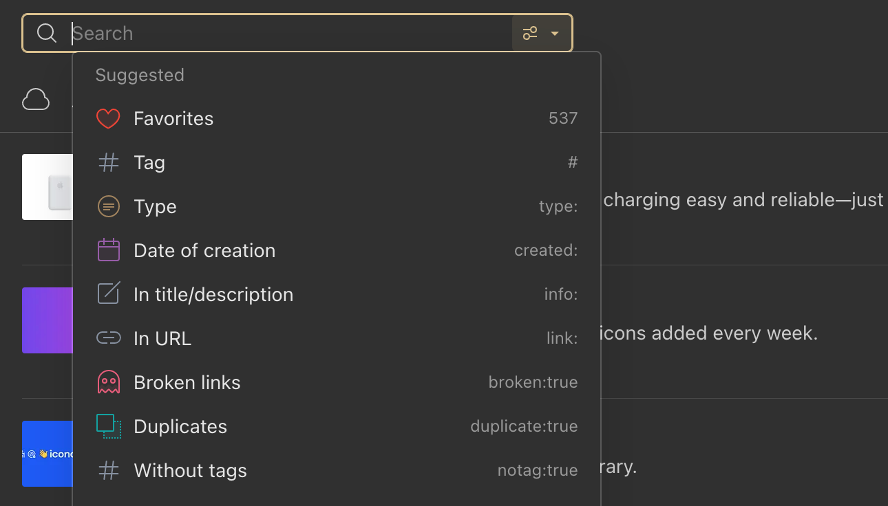

Tags allow for detailed characterization of an item.
You can tag items based on their topics, methods, status, ratings, or even based on your own workflow (e.g., `to-read`).

Items can have as many tags as you like, and you can [filter your library](#by-tag) (or a specific collection) to show items having a specific set of one or more tags.

Raindrop.io tags are special. They allow you to name them using any characters, in any language and most importantly – with spaces.

<!------------------------------>

### Adding tags to items

Read more in [bookmarks article](../bookmarks/index.md#tags)

<!------------------------------>

### Search by tag {#by-tag}

All of your tags are visible in the sidebar on the left of your browser.
You can click one of these and Raindrop.io will bring up all items tagged with that tag, much like a global search.

The search box at the top of a screen can be used to search for tags.
Type `#` the search box to see all tags.

<!------------------------------>

### Search by excluding tag {#exclude-tag}

To find items that doesn't have some specific tag just put - (dash) in front of a tag you want exclude. For example `-#exclude`

<!------------------------------>

### Bulk editing tags

To rename/remove a tag across all items it is assigned to please use our [Tag manager](https://extension.raindrop.io/#/app/tags).

You can merge tags by selecting them and then click `Merge`.

<!------------------------------>

### Find items without any tags {#without-tags}

Focus on a search field and then click `Without tags` filter

