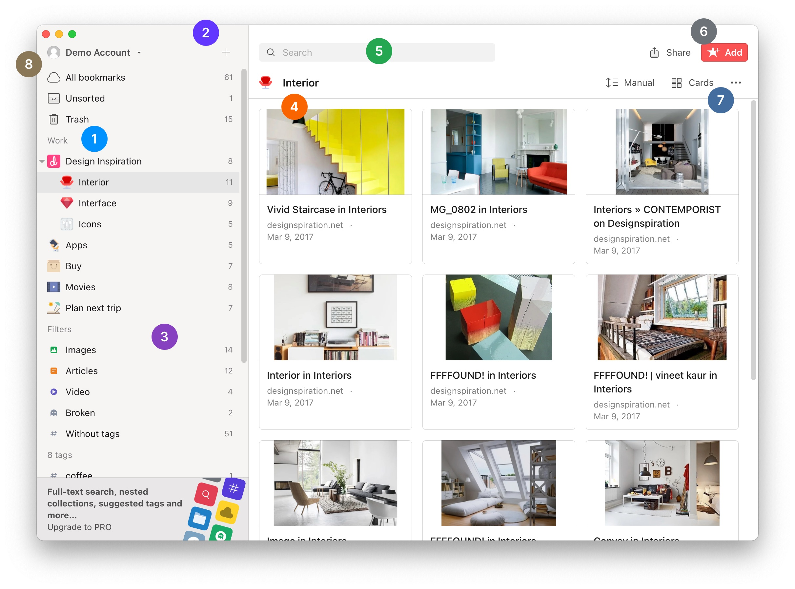

To be more familiar with Raindrop.io let's check the main parts of a user interface. Deep dive to learn more about each feature.

1. [Collections](../collections-groups/index.md) &mdash; are essentially just folders
2. [Create new collection](../collections-groups/index.md#create-a-collection)
3. [Filters & tags](../tags-filters/index.md) &mdash; your items automatically clasified into many categories
4. [Bookmarks](../bookmarks/index.md) & [Files](../files/index.md) &mdash; mix-and-match different content
5. [Search](../search/index.md)
6. [Add new item](../bookmarks/index.md#add-new-bookmark), [Share](../public-page/index.md) and [Collaborate](../collaboration/index.md) &mdash; 
7. [Collection appearance](../bookmarks.md) &mdash; 
8. [Profile & settings](../../getting-started/account-settings.md) &mdash; 